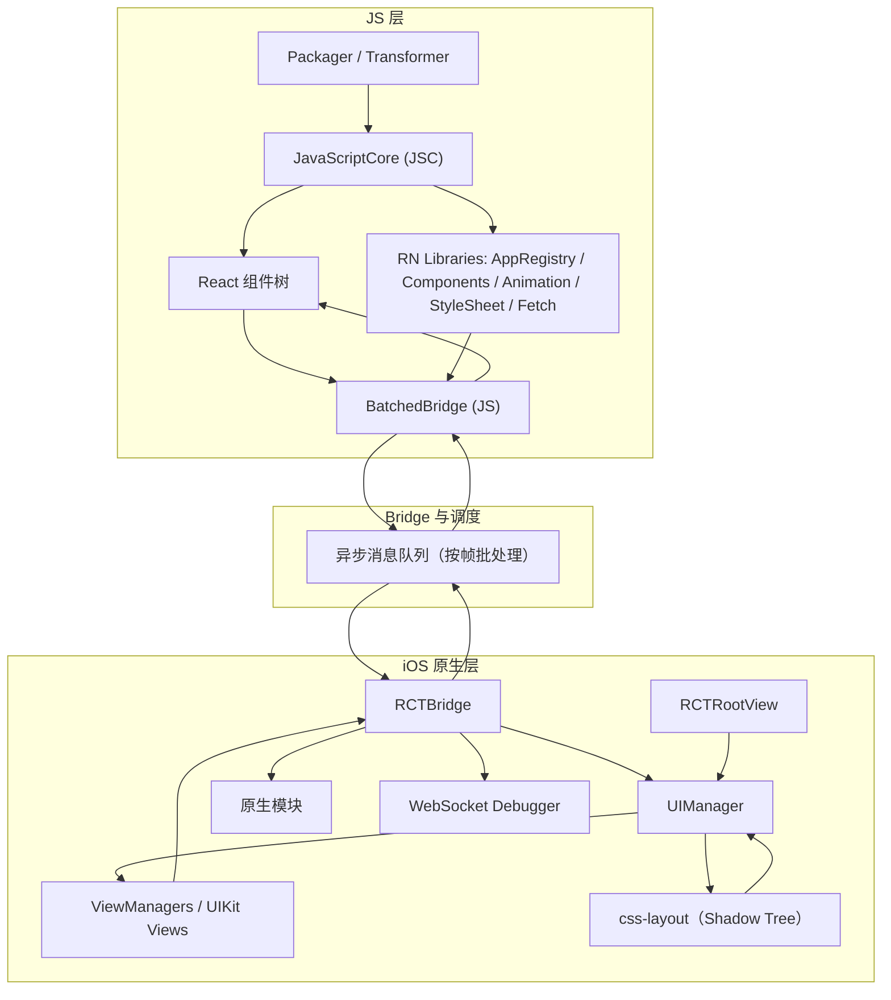
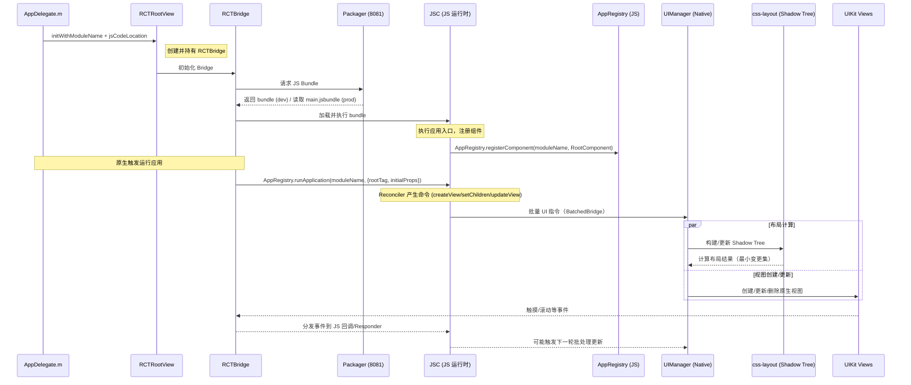

# 概览

## 1. 阅读文档（cursor）

我先把 4 个文档打开通读一遍，提炼要点并据此绘制“架构总览图”和“启动链路时序图”。随后给出每篇文档的要点笔记。

[5 tools called]

我已通读四篇文档并完成架构图、启动时序图与要点笔记。先把相关待办勾选完成，然后贴出整理结果。

[1 tool called]

### 架构总览图（v0.1.0，文字版）

- JS 层
  - **React**: 组件与虚拟树（JSX/ES6）
  - **Libraries**:
    - `AppRegistry` 注册根组件
    - `Components` 基础组件：`View`/`Text`/`Image`/`ScrollView`/`Touchable*`
    - `BatchedBridge` 批处理消息发送
    - `Animation`/`Interaction`/`StyleSheet`/`Fetch`/`Network`/`Storage` 等
  - **JavaScript 执行环境**: JavaScriptCore（JSC），由原生侧提供
  - **打包与开发**: `packager` 提供 transform、bundle、缓存、HMR 调试体验

- Bridge 与调度
  - **Batched、异步、线程分离**：JS 与 Native 间通过消息队列传递
  - **事件流**：Native 事件 → Bridge → JS Responder/回调，按帧批量

- Native 层（iOS）
  - **Core**: `RCTBridge`（消息编解码与调度）、`RCTRootView`（承载 RN 视图树）、`RCTModuleData`
  - **Views**: `React/Views/*`（`RCTView` 及各 ViewManager）
  - **Modules**: `React/Modules/*`（Alert、AsyncStorage、Geolocation、Linking、Vibration…）
  - **Layout**: `React/Layout/css-layout.c`（早期 Flexbox 引擎，独立线程计算 shadow tree）
  - **Debugger**: `RCTWebSocketDebugger` + `packager/debugger.html`

- 关键特性
  - 完全异步的 JS↔Native 通信，不阻塞主线程
  - Shadow tree 上计算布局，最小变更集应用到主线程 UIKit
  - 可扩展：自定义原生模块与视图管理器

### 启动链路时序图（文字版）

1) Xcode 启动原生 App
- `AppDelegate.m` 创建 `RCTRootView`，配置 `jsCodeLocation`（packager 或本地 `main.jsbundle`）
- `RCTRootView` 持有 `RCTBridge`，初始化 JSC，加载 JS bundle

2) JS Bundle 初始化
- 解析入口文件（示例工程是 `Examples/*/index.ios.js` 或 `MoviesApp.js`）
- 执行 `AppRegistry.registerComponent('ModuleName', () => RootComponent)`

3) 根视图挂载
- 原生调用 JS：请求运行 `AppRegistry.runApplication('ModuleName', {initialProps, rootTag})`
- JS 创建 React 组件树 → 通过 `BatchedBridge` 产生 UIManager 指令（createView、setChildren、updateView）

4) 布局与渲染
- Shadow tree 计算布局（`css-layout`）
- 计算结果与最小变更集在主线程应用到 UIKit 视图
- 事件从 Native 回流 JS（Responder/回调）并按帧批处理

5) 热重载与调试
- `packager` 通过 `http://localhost:8081/...bundle` 提供增量与调试
- 可加载 `debugger.html`/WebSocket 调试

### 每章要点笔记

- README.md
  - **核心定位**: React 语法 + 原生渲染，无浏览器/HTML，直接映射 UIKit
  - **异步与批处理**: Diff 在 shadow tree 线程，最小变更集落到主线程
  - **开发体验**: 即时刷新、`StyleSheet`（JS 对象）、Flexbox 布局、Responder 系统
  - **示例**: `Examples/Movies`、`Examples/UIExplorer`；使用 `npm start` 启动 packager

- docs/GettingStarted.md
  - 使用 `react-native-cli` 初始化 `AwesomeProject`
  - Xcode 打开 `.xcodeproj` 直接运行；`cmd+R` 重载
  - 依赖：OS X、Xcode、Homebrew、node、watchman、flow（可选）

- docs/NativeModulesIOS.md
  - **扩展点**: 自定义 Objective-C 模块，协议 `RCTBridgeModule`
  - **方法导出**: `RCT_EXPORT()`/`RCT_EXPORT(name)`，返回 `void`
  - **参数类型**: NSString/NSNumber/BOOL/NSArray/NSDictionary/函数（`RCTResponseSenderBlock`）
  - **线程模型**: 模块方法在专用串行队列执行；主线程 API 需 `dispatch_async` 到 main
  - **常量导出**: `constantsToExport` 初始时注入
  - **事件**: `bridge.eventDispatcher.sendAppEventWithName` → JS `DeviceEventEmitter.addListener`

- docs/GestureResponderSystem.md
  - **目标**: 组件树内协商触摸归属，支持多指与阶段切换
  - **触摸生命周期**: shouldSetResponder → grant/reject → move → release/terminate
  - **捕获阶段**: `onStartShouldSetResponderCapture`/`onMoveShouldSetResponderCapture`
  - **抽象组件**: `Touchable*` 基于 Responder，声明式配置点击交互
  - **事件对象**: `nativeEvent` 包含坐标、标识、时间戳、触点集合

### 一图速记（关键关系）

- JS React 树 → BatchedBridge 指令 → UIManager → 原生视图管理器 → UIKit
- Native 事件 → Bridge → JS 回调/Responder → 可能触发 setState → 新一轮批处理
- 布局在 shadow tree（独立线程）计算，结果合并到主线程渲染

需要我把上面的两张图转成正式的可视化（如 mermaid 或可导出 PNG/SVG）吗？或者我们直接进入第2章，从 `Examples/SampleApp/index.ios.js` 开始走读渲染链路。

### 模块作用速览

- **RCTBridge**
  - JS 与原生的“消息总线”。加载/执行 JS Bundle，维护模块注册表与消息队列，负责编解码调用与事件派发。
  - 位置：`React/Base/`。关联：`Libraries/BatchedBridge/*`（JS 侧批处理）与 `RCTEventDispatcher`（事件）。

- **RCTRootView**
  - React Native 应用的“原生容器视图”。承载一个模块（moduleName），持有/复用 `RCTBridge`，作为根节点接收 UI 指令生成的 UIKit 视图树。
  - 位置：`React/Base/`。入口由 `AppDelegate.m` 创建并设置 `jsCodeLocation`。

- **UIManager**
  - 视图创建/更新/删除的“调度器”。接收 JS 侧批量 UI 命令（createView/setChildren/updateView），在主线程对 UIKit 应用最小变更集，并与布局引擎交互。
  - 位置：`React/Views/`（如 `RCTUIManager` 相关文件）。

- **Views（ViewManagers & UIKit Views）**
  - JS 组件到原生视图的“适配层”。每个原生控件有对应的 `RCTViewManager` 暴露属性/事件，底层是具体的 `UIView` 子类。
  - 位置：`React/Views/*`。示例：`RCTView`, `RCTText`, `RCTImageView` 及各自的 `*Manager`。

- **Modules（原生模块）**
  - 非 UI 能力的“系统 API 封装”。实现 `RCTBridgeModule` 协议，通过 `RCT_EXPORT` 导出异步方法、常量，支持事件回传（`eventDispatcher`）。
  - 位置：`React/Modules/*` 与部分 `Libraries/*`（如 `Geolocation`、`LinkingIOS`、`Vibration`、`AsyncStorage`）。

- **Layout（css-layout / Shadow Tree）**
  - Flexbox 布局引擎与“影子树”计算。在独立线程计算节点尺寸/位置，产出最小变更集供 `UIManager` 应用到主线程 UIKit。
  - 位置：`React/Layout/css-layout.*`。

- **Debugger（WebSocket Debugger）**
  - 开发期调试通道。通过 WebSocket 与调试前端/packager 交互，实现日志、调试命令、（早期形态的）远程调试。
  - 位置：`Libraries/RCTWebSocketDebugger/*` 与 `packager/debugger.html`。

### 关系一眼记
- JS 树 → `BatchedBridge` → `RCTBridge` → `UIManager` → ViewManagers → UIKit
- 事件：UIKit → `RCTBridge` → JS 回调/Responder
- 布局：JS 变更 → Shadow Tree（css-layout）→ 最小变更集 → `UIManager` 应用到主线程

### 架构总览图（Mermaid）

如果仍有渲染问题，告诉我你的渲染环境（如 VSCode 插件/网站版本），我再提供兼容性更高的超简版。

### 启动链路时序图（Mermaid）

